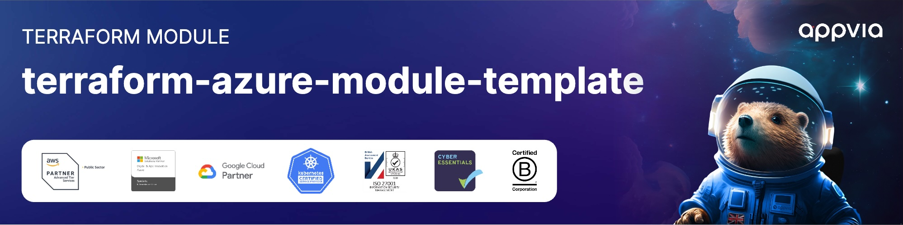

<!-- markdownlint-disable -->

<a href="https://www.appvia.io/"></a><br/><p align="right"> </a> <a href="https://github.com/appvia/__REPO_NAME__/releases/latest"></a> <a href="https://appvia-community.slack.com/join/shared_invite/zt-1s7i7xy85-T155drryqU56emm09ojMVA#/shared-invite/email"></a> <a href="https://github.com/appvia/__REPO_NAME__/graphs/contributors"></a>

<!-- markdownlint-restore -->
<!--
  ***** CAUTION: Banner URLs are managed by scripts/init-from-template.sh ******
-->


# Terraform <NAME>

## Description

Add a description of the module here

## Usage

Add example usage here

```hcl
module "example" {
  source  = "appvia/<NAME>/azure"
  version = "0.0.1"

  # insert variables here
}
```

## Examples

See the [examples](./examples) directory for working usage examples.

- [Basic](./examples/basic) - A basic example of how to use this module.

<!-- BEGIN_TF_DOCS -->
<!-- END_TF_DOCS -->

## Contributing

Contributions are welcome. Please read the [Code of Conduct](./CODE_OF_CONDUCT.md) before contributing.

## License

This project is licensed under the terms of the [GPL-3.0 license](./LICENSE).
